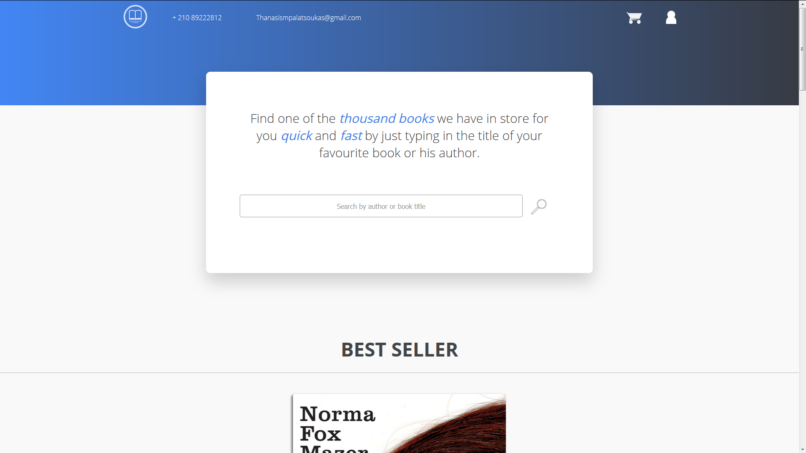
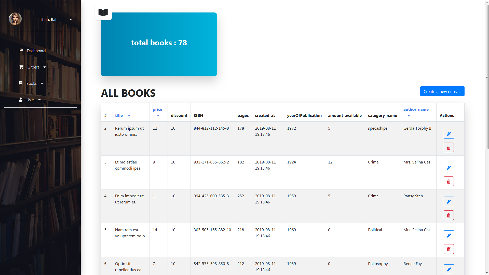
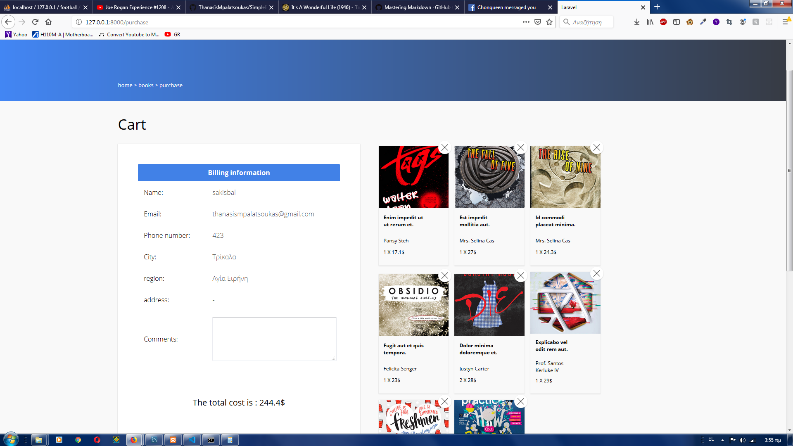
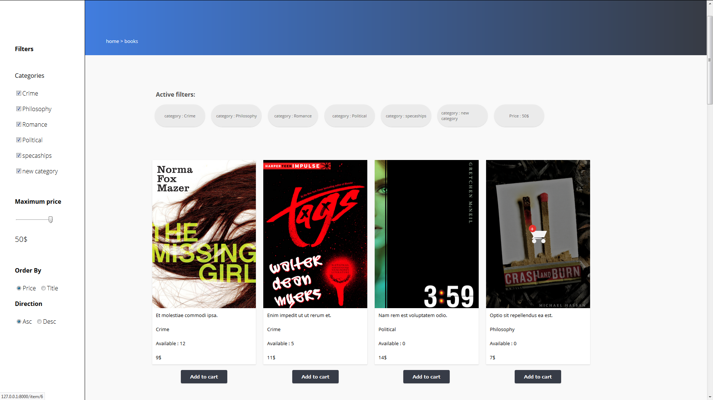

# Simple book store

This website is a very simple implementation of a bookstore and is created mainly for showcase purposes.

### Homepage

### Admin page

### Cart

### Filtered products

## How to use this

All you need to do is copy the files to a directory able to php scripts. Next thing you have to do is create a new database table called **SimpleBookStore**. Last step is to go to the directory that your root file is located with a cmd and type

 `php artisan serve`

This will let you view the website on 127.0.0.1:8000 on any broswer. To migrate and seed the database the following steps are

`php artisan migrate`

`php artisan db:seed`

If you want to enable the PAYPAL payment method you need to have created a buyers and sellers account on paypal sandbox and the input your credentials on the env.php
file. **PAYPAL_CLIENT_ID = *your id here***, **PAYPAL_SECRET = *your secret here***

## Features

The website is featuring : 

* Login/Logout system with custom inputs
     * username
     * password
     * email
     * phone number
     * City ( a certain amount of cities )
     * Region ( every region connected to a city )
     * address
* Books with the following attributes:
     * category
     * title
     * description
     * details
     * ISBN (randomly generated)
     * book cover
     * price (randomly generated)
     * discount
* Admin page on \admin
     * Book Crud functionality
     * Regions Crud functionality
     * Categories Crud functionality
     * Cities Crud functionality
     * Author Crud functionality
* Cities and regions automatically connected on registering
* Costs of books automatically change based on discount and region location
* Fully functional shopping cart
* Filtering books for easier navigation
* Payment gateway using paypal

## Stack used

In a trial to learn laravel and reactJs on the same time i have created different parts of the website using different technologies. I am filtering the books using ReactJs and i am using Laravel for the rest.

* Laravel
* ReactJs
* Jquery
* MySql
* scss

## Comming Soon...

* User roles. *(admin,simple user)*
* Responsive design